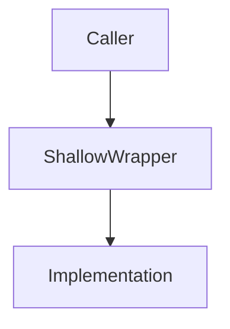
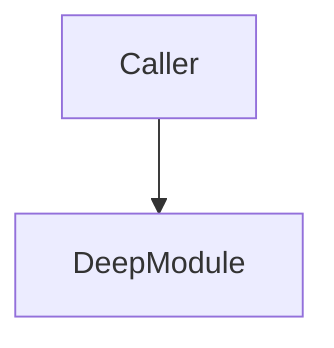

# Markdown Report Format

The architectural review is written as a single self-contained Markdown file inside the current workspace under `.plans/analysis/architecture-review-<timestamp>.md`.

## Scaffold

```markdown
# Architecture Review — {{repo name}}

Date: YYYY-MM-DD

## Top Recommendation

- **Candidate**: [{{Title}}](#{{anchor-slug}})
- **Why**: One sentence reasoning.

## Candidates

### {{Title}}

- **Involved Files**:
  - `{{repo-relative-path/to/file1.ts}}` (lines X-Y) - absolute path: `{{absolute-path/to/file1.ts}}`
  - `{{repo-relative-path/to/file2.ts}}` - absolute path: `{{absolute-path/to/file2.ts}}`
- **Strength**: Strong | Worth exploring | Speculative
- **Category**: in-process | local-substitutable | ports & adapters | mock
- **Problem**: One sentence. Why the current interface causes friction, referencing the exact lines of code where the friction occurs.
- **Solution**: One sentence. What changes.

#### Visualizations

##### Before


##### After


#### Wins
- **Locality**: {{bullet point ≤6 words}}
- **Leverage**: {{bullet point ≤6 words}}
```

## Tone

Plain English, concise — but the architectural nouns and verbs come straight from the `/codebase-design` skill. Concision is not an excuse to drift.

**Use exactly:** module, interface, implementation, depth, deep, shallow, seam, adapter, leverage, locality.

**Never substitute:** component, service, unit (for module) · API, signature (for interface) · boundary (for seam) · layer, wrapper (for module, when you mean module).
