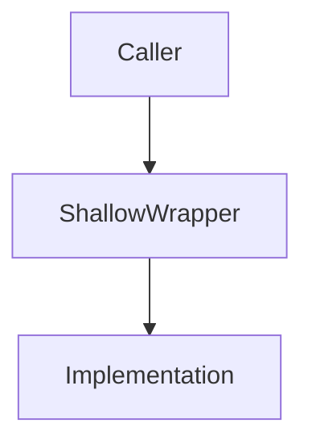
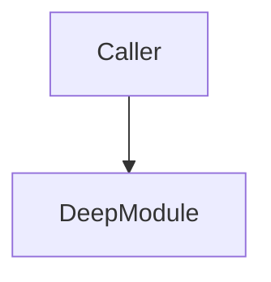

# Improve Codebase Architecture

Surface architectural friction and propose **deepening opportunities** — refactors that turn shallow modules into deep ones. The aim is testability and AI-navigability.

This command is built on a shared design vocabulary:

- Run the `/codebase-design` skill for the architecture vocabulary (**module**, **interface**, **depth**, **seam**, **adapter**, **leverage**, **locality**) and its principles (the deletion test, "the interface is the test surface", "one adapter = hypothetical seam, two = real"). Use these terms exactly in every suggestion — don't drift into "component," "service," "API," or "boundary."

## Process

### 1. Explore

Use the Agent tool with **`subagent` scout** to walk the codebase. Don't follow rigid heuristics — explore organically and note where you experience friction:

- Where does understanding one concept require bouncing between many small modules?
- Where are modules **shallow** — interface nearly as complex as the implementation?
- Where have pure functions been extracted just for testability, but the real bugs hide in how they're called (no **locality**)?
- Where do tightly-coupled modules leak across their seams?
- Which parts of the codebase are untested, or hard to test through their current interface?

Apply the **deletion test** to anything you suspect is shallow: would deleting it concentrate complexity, or just move it? A "yes, concentrates" is the signal you want.

### 2. Present candidates via `plan_artifact`

Call the `plan_artifact` tool with:

- **`summary`**: Short summary, e.g. `"Architecture review: <repo> — <N> deepening candidates"`
- **`plan`**: Full markdown with `##` headings for each candidate section.

The plan markdown should follow this structure:

```
## Top Recommendation

- **Candidate**: <Title>
- **Why**: One sentence.

## <Candidate Title>

- **Involved Files**: `repo/rel/path.ts` — absolute: `/abs/path.ts`
- **Strength**: Strong | Worth exploring | Speculative
- **Category**: in-process | local-substitutable | ports & adapters | mock
- **Problem**: One sentence referencing exact lines.
- **Solution**: One sentence.

### Before



### After



### Wins
- **Locality**: ≤6 words
- **Leverage**: ≤6 words
```

Repeat the candidate section for each candidate. End with the **Top Recommendation**.

**Use the `/codebase-design` vocabulary**: module, interface, implementation, depth, deep, shallow, seam, adapter, leverage, locality. Never substitute: component, service, API, signature, boundary, layer, wrapper.

The browser UI supports inline commenting and accept/request-changes workflow — no manual `ask_user_question` needed for candidate selection.

### 3. Grilling loop

Once the user accepts a plan (via the browser UI's Accept button), run the `/grill-me` skill to walk the design tree with them — constraints, dependencies, the shape of the deepened module, what sits behind the seam, what tests survive.

If the user requests changes via the browser UI, revise the plan and call `plan_artifact` again with updated content.

- **What would you like to do next?**
  - Use `ask_user_question` to offer choices:
    ```
    ask_user_question(
        question="What would you like to do next?",
        options=[
            {"label": "Explore alternative interfaces for the deepened module (Recommended)", "value": "explore_alternatives"},
            {"label": "Proceed with the current design and deepen the module", "value": "proceed_deepen"},
            {"label": "Re-evaluate candidate selection", "value": "re_evaluate"},
            {"label": "Other", "value": "other"}
        ]
    )
    ```
  - If `explore_alternatives` is chosen, run the `/codebase-design` skill and use its design-it-twice parallel sub-agent pattern.
  - If `other` is chosen, capture the user's text input and act accordingly.
