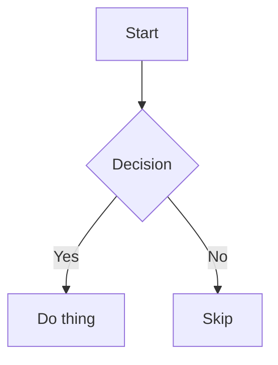

# Obsidian Notes — Syntax Reference

Obsidian uses **Obsidian-Flavored Markdown** (OFM) — a superset of CommonMark and
GitHub-Flavored Markdown (GFM) with proprietary extensions. Several features only
render inside Obsidian and **will not render** in GitHub, VS Code preview, or other
standard Markdown renderers.

---

## 1. Properties (Frontmatter / YAML)

Properties are YAML at the very top of a file, enclosed by `---` fences. They
must appear on the **first line** of the file — no content before them.

```yaml
---
title: My Note
tags:
  - research
  - draft
aliases:
  - "Old Name"
  - "Also Known As"
cssclasses:
  - wide-page
created: 2024-06-01
updated: 2024-06-15T10:30:00
priority: 3
done: false
related: "[[Another Note]]"
links:
  - "[[Note A]]"
  - "[[Note B]]"
---
```

### Property Types

| Type        | YAML Example                          | Notes |
|-------------|---------------------------------------|-------|
| Text        | `title: My Note`                      | Single line; no Markdown rendered |
| List        | `tags:\n  - a\n  - b`                | Multi-value; hyphen-space each |
| Number      | `priority: 3` / `score: 9.5`         | Integer or decimal |
| Checkbox    | `done: true` / `done: false`         | Renders as toggle in Live Preview |
| Date        | `date: 2024-06-01`                    | ISO 8601 `YYYY-MM-DD` |
| Date & time | `time: 2024-06-01T10:30:00`          | ISO 8601 with `T` separator |
| Tags        | `tags:\n  - tag1\n  - tag2`          | Special type; only for `tags` key |

### Rules
- **Internal links in properties MUST use quotes**: `related: "[[Note Name]]"`
- Property names are case-insensitive and vault-wide — assigning a type to `priority`
  in one note makes it that type everywhere.
- Nested properties are **not supported** in Live Preview (use source mode to view).
- Markdown formatting is **not rendered** inside property values.
- Deprecated (Obsidian < 1.4): `tag`, `alias`, `cssclass` — use the plural forms above.

### Default / Reserved Properties

| Property     | Type  | Purpose |
|--------------|-------|---------|
| `tags`       | Tags  | Vault tags (also set inline with `#tag`) |
| `aliases`    | List  | Alternative names for the note; power wikilink autocomplete |
| `cssclasses` | List  | CSS classes applied to the note body |
| `publish`    | Checkbox | Obsidian Publish control |
| `permalink`  | Text  | Obsidian Publish URL path |
| `description`| Text  | Social share description (Publish) |

---

## 2. Internal Links — Wikilinks

The primary link format in Obsidian. Always prefer wikilinks over Markdown links for
internal vault navigation.

### Basic Forms

| Syntax | Renders As | Notes |
|--------|------------|-------|
| `[[Note Name]]` | Note Name | Links to a file named `Note Name.md` |
| `[[Note Name\|Display Text]]` | Display Text | Alias / custom label |
| `[[folder/Note Name]]` | Note Name | Path from vault root (optional; shortest unique name works) |
| `[[Note Name.png]]` | Note Name.png | Non-markdown files need extension |

### Heading & Block Anchors

```
[[Note Name#Heading]]          → links to a heading in another note
[[Note Name#Heading|Label]]    → same with alias
[[#Heading]]                   → links to a heading in the SAME note
[[Note Name#^block-id]]        → links to a specific block (paragraph/list item)
[[#^block-id]]                 → links to a block in the SAME note
```

### Block References

Assign a block ID to any paragraph or list item by appending `^id` at the end.
IDs must be **Latin letters, numbers, and hyphens only** — no spaces.

```markdown
This is a paragraph I want to reference. ^my-paragraph-id

- A list item ^list-item-id
```

For structured blocks (callouts, blockquotes, tables), the `^id` goes on its **own
line** with blank lines before and after:

```markdown
> A blockquote I want to reference.

^quote-id

Continuing text here.
```

Blocks used in `ROADMAP.md` for task tracking follow the `^phase-N-M-slug` pattern:
```markdown
- [x] Complete the refactor ^phase-4-1-types
```

---

## 3. Embeds

Prefixing any internal link with `!` embeds the content inline.

```markdown
![[Note Name]]                  → embed entire note
![[Note Name#Heading]]          → embed a section (from heading to next same-level)
![[Note Name#^block-id]]        → embed a specific block
![[image.png]]                  → embed image at natural size
![[image.png|400]]              → embed image with 400px width
![[image.png|400x300]]          → embed image with fixed dimensions
![[audio.mp3]]                  → embed audio player
![[video.mp4]]                  → embed video player
![[file.pdf]]                   → embed PDF viewer
```

---

## 4. Tags

```markdown
#tag                  Inline tag — works anywhere in the note body
#nested/tag           Hierarchical tag; also creates parent tag #nested
```

Tags can also be defined in frontmatter (preferred for organization):
```yaml
---
tags:
  - research
  - project/alpha
---
```

Rules:
- Tags **cannot contain spaces**; use hyphens or slashes for compound tags.
- A `#` followed by a digit (e.g., `#1`) is NOT a tag.
- Inline tags become part of the vault tag index and appear in Search.

---

## 5. Callouts

Callouts transform blockquotes into styled highlight boxes.

### Basic Syntax

```markdown
> [!note] Optional Custom Title
> Callout body. Supports **Markdown**, [[wikilinks]], and ![[embeds]].
> Multiple lines of content.
```

### Foldable Callouts

```markdown
> [!tip]+ Expanded by default
> Content visible initially.

> [!warning]- Collapsed by default
> Content hidden initially; click title to expand.
```

### Nested Callouts

```markdown
> [!question] Can callouts be nested?
> > [!todo] Yes!
> > > [!example] Even three levels deep.
```

### All Built-in Types

| Type | Aliases | Color / Icon |
|------|---------|--------------|
| `note` | — | Blue, pencil |
| `abstract` | `summary`, `tldr` | Cyan, clipboard |
| `info` | — | Blue, info circle |
| `todo` | — | Blue, check-circle |
| `tip` | `hint`, `important` | Teal, flame |
| `success` | `check`, `done` | Green, checkmark |
| `question` | `help`, `faq` | Yellow, circle-question |
| `warning` | `caution`, `attention` | Orange, alert triangle |
| `failure` | `fail`, `missing` | Red, X |
| `danger` | `error` | Red, zap |
| `bug` | — | Red, bug |
| `example` | — | Purple, list |
| `quote` | `cite` | Grey, quote |

Any **unrecognized** type falls back to `note` styling. Type identifiers are
**case-insensitive**.

---

## 6. Text Emphasis & Highlights

| Style | Syntax | Example |
|-------|--------|---------|
| Bold | `**text**` or `__text__` | **Bold** |
| Italic | `*text*` or `_text_` | *Italic* |
| Bold + Italic | `***text***` | ***Bold italic*** |
| Strikethrough | `~~text~~` | ~~Struck~~ |
| Highlight | `==text==` | ==Highlighted== (Obsidian-only) |
| Inline comment | `%%text%%` | Invisible in Reading view (Obsidian-only) |
| Inline code | `` `code` `` | `code` |

Block comment (invisible in Reading view):
```
%%
This entire block is a comment.
It can span multiple lines.
%%
```

Escape any Markdown character with `\`:
```markdown
\*\*Not bold\*\*
\[[Not a link\]]
```

---

## 7. Headings

```markdown
# H1
## H2
### H3
#### H4
##### H5
###### H6
```

- Headings create anchors for `[[Note#Heading]]` links.
- H1 is typically reserved for the note title; most notes start at H2 for sections.
- The **Outline** core plugin generates a panel from headings.
- Avoid skipping heading levels (H1 → H3) — it breaks outline navigation.

---

## 8. Task Lists

Standard GFM tasks:
```markdown
- [ ] Incomplete task
- [x] Completed task
```

Obsidian supports **custom task statuses** via themes and plugins. This vault uses:
```markdown
- [ ]  Unchecked / todo
- [x]  Complete / done
- [/]  Partial / blocked
- [-]  Cancelled / dismissed
- [*]  Starred
- [⚡] In-progress (agent actively working)
- [₸]  Needs testing (implemented, awaiting manual validation)
```

Nested tasks (indent with `Tab`):
```markdown
- [ ] Parent task
	- [ ] Sub-task 1
	- [x] Sub-task 2 (done)
```

---

## 9. Tables

```markdown
| Column 1 | Column 2 | Column 3 |
|----------|:--------:|---------:|
| Left     | Center   | Right    |
| data     | data     | data     |
```

Alignment: `:--` left, `:--:` center, `--:` right.

**Pipes within table cells** must be escaped:
```markdown
| Note | `[[Link\|Alias]]` |
| Img  | `![[image.png\|200]]` |
```

Right-click a table in Live Preview to insert/delete rows and columns.

---

## 10. Mermaid Diagrams

````markdown

````

Add internal links to diagram nodes with the `internal-link` class:
````markdown

````

Common diagram types: `graph`/`flowchart`, `sequenceDiagram`, `classDiagram`,
`gantt`, `pie`, `mindmap`, `timeline`, `gitGraph`.

---

## 11. Math (LaTeX / MathJax)

Inline math: `$e^{i\pi} + 1 = 0$`

Block math:
```markdown
$$
\sum_{n=1}^{\infty} \frac{1}{n^2} = \frac{\pi^2}{6}
$$
```

---

## 12. Code Blocks

````markdown
```typescript
const greeting: string = "Hello, Obsidian!";
console.log(greeting);
```
````

Syntax highlighting uses **Prism** in Reading view; CodeMirror in Live Preview.
Supported language identifiers: `typescript`, `javascript`, `python`, `css`,
`html`, `json`, `yaml`, `bash`, `sh`, `sql`, `rust`, `go`, `java`, `cpp`, etc.

---

## 13. Lists

Unordered:
```markdown
- Item A
- Item B
  - Nested (2 spaces or tab)
```

Ordered:
```markdown
1. First
2. Second
   1. Nested ordered
```

Mix types freely within nested structures.

---

## 14. Blockquotes

```markdown
> This is a blockquote.
> It can span multiple lines.

> Nested blockquotes:
> > Second level
> > > Third level
```

---

## 15. Footnotes

```markdown
Inline reference[^1] in text.

[^1]: The footnote definition can go anywhere in the document.

Named footnote[^named].

[^named]: Named footnotes still render as numbers.

Inline footnote^[This text becomes the footnote content].
```

Note: Inline footnotes (`^[...]`) only render in Reading view, not Live Preview.

---

## 16. Horizontal Rule

```markdown
---
***
___
```

All three produce a horizontal divider. `---` is most common.

---

## 17. Images

External image:
```markdown

   ← resize width
 ← resize exact
```

Internal image (use embed syntax):
```markdown
![[image.png]]
![[image.png|400]]
![[attachments/diagram.svg|600x400]]
```

---

## 18. Aliases

Add alternative names a note can be found by and linked as:
```yaml
---
aliases:
  - "Short Name"
  - "Other Name"
---
```

Then `[[Short Name]]` will resolve to this note. In wikilinks, you can also use
`[[Note Name|Display Text]]` for a one-off display label (not an alias).

---

## 19. Obsidian URIs

Link to a note in any vault from outside Obsidian:
```
obsidian://open?vault=MyVault&file=Note%20Name.md
```

In Markdown links within a note:
```markdown
[Open in vault](obsidian://open?vault=MyVault&file=Note%20Name)
```

---

## 20. Vault Conventions (This Dev Vault)

### File Naming
- **All-caps with hyphens** for top-level docs: `ROADMAP.md`, `TESTING.md`,
  `TECHNICAL.md`, `DOCS.md`, `CHANGELOG.md`, `AGENTS.md`
- **PascalCase** for fixture/data notes: `Data/fixture-note.md`, `Data/test-note.md`

### Note Structure Pattern
```markdown
---
tags:
  - category
  - status
created: YYYY-MM-DD
---

# Note Title

One-line summary sentence.

## Section

Content...
```

### Git Branches
- Vault docs (`ROADMAP.md`, `TESTING.md`, etc.) → commit on `vault` branch
- Plugin source (`.obsidian/plugins/RnD-Env/`) → commit on `dev` branch
- Never mix the two in one commit.

### ROADMAP.md Specifics
Each task line ends with a block reference `^phase-N-M-slug`:
```markdown
- [ ] Do something important ^phase-5-3-expand
```
These refs are used by `mark_task(blockRef, status)` — pass the ref **without** the `^`.

Task status characters in `ROADMAP.md` and `TESTING.md`:
```
[ ]  = todo
[⚡] = in-progress (agent is actively working)
[₸]  = needs-testing (awaiting manual Obsidian validation)
[/]  = partial / blocked
[x]  = complete
[-]  = cancelled
```

### TESTING.md Specifics
Each test scenario follows this structure:
```markdown
## Scenario Title

**Linked tasks:** `^block-ref-1`, `^block-ref-2`

**Prerequisites:** Run `/reload` after code changes.

### Steps
1. Open Obsidian and navigate to…
2. Click…
   - Verify: Expected intermediate state

### Expected Outcome
Clear, unambiguous description of what success looks like.

---
> [!success]- ✅ Passed
> (empty — user fills in when validated)

> [!failure]- ❌ Failed
> Feedback: (user fills in if failed)
```

---

## 21. Portability Note

The following Obsidian syntax is **non-portable** (does not render outside Obsidian):
- `[[Wikilinks]]` and `![[Embeds]]`
- `[[Note#^block-id]]` block references
- `==Highlights==`
- `%%Comments%%`
- Callouts (`> [!type]`)
- Custom task statuses (`[⚡]`, `[₸]`, etc.)
- Plugin-specific code blocks (`rnd-progress`, `dataview`, etc.)

When portability matters, use standard Markdown links `[text](file.md)` instead of
wikilinks and avoid Obsidian-specific syntax.
